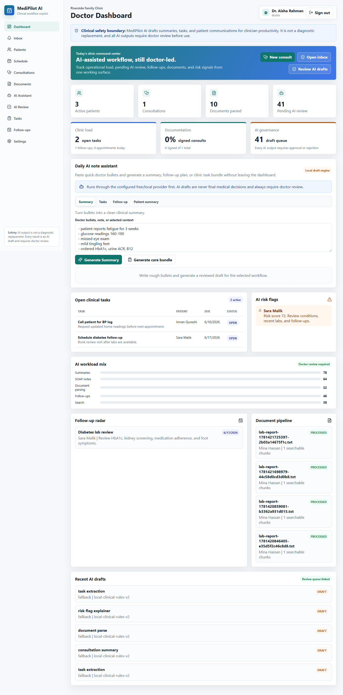
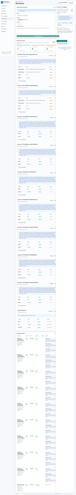
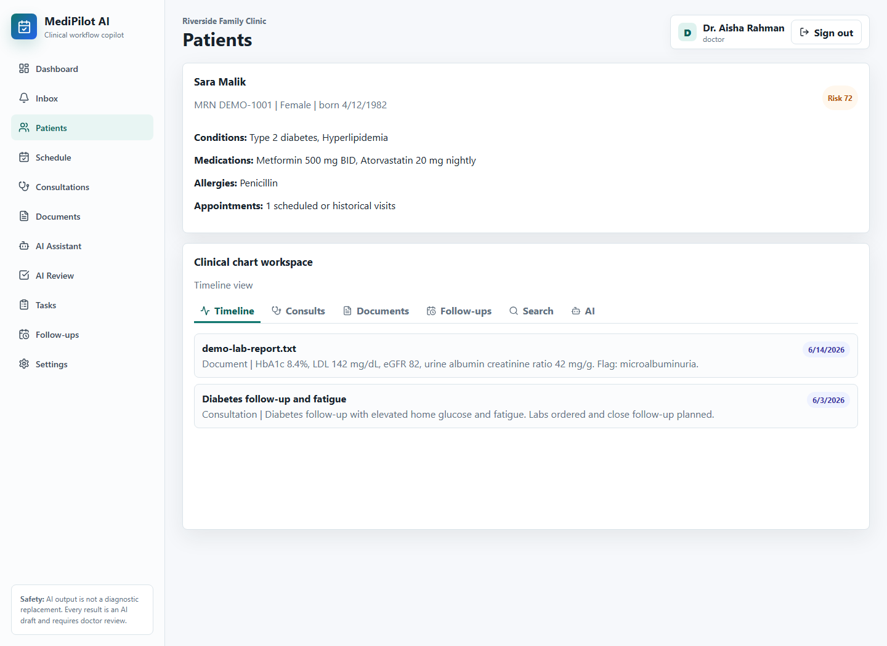
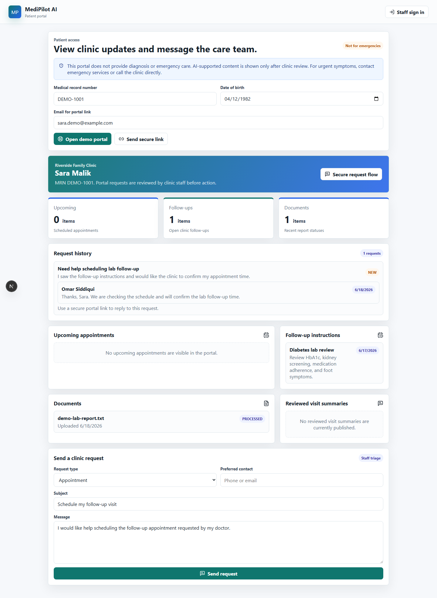
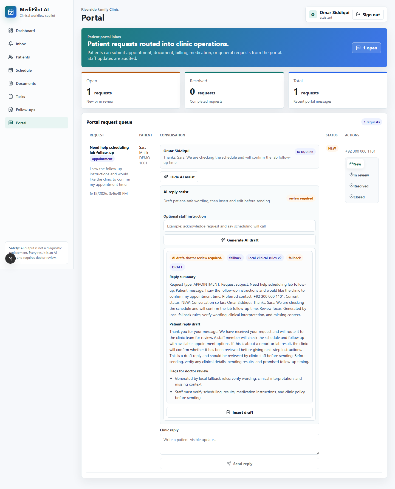

# MediPilot AI

MediPilot AI is a production-minded, local-first AI clinical workflow assistant for doctors and small clinics. It helps clinicians manage patients, consultations, documents, notes, tasks, follow-ups, and AI-generated drafts while preserving a clear safety boundary: **AI output is not a diagnostic replacement and always requires doctor review.**

## Highlights

- Next.js App Router with TypeScript, API route handlers, and polished dashboard UI.
- PostgreSQL database with Prisma models for clinics, users, patients, consultations, notes, documents, chunks, embeddings, AI generations, tasks, follow-ups, patient portal requests, and audit logs.
- Role-based access for doctors, clinic admins, and assistants, with assistants limited to operational workflows instead of clinical AI review or configuration.
- Patient portal flow at `/portal` with demo MRN/DOB access, secure email magic links, upcoming appointments, follow-up instructions, reviewed visit summaries, document statuses, request history, and patient-to-clinic conversations.
- Free local-first AI abstraction with Ollama default, `qwen2.5:7b` configured for no-cost clinical drafting, runtime status checks, gated external adapters, structured prompts, JSON validation, semantic search, and a deterministic `local-clinical-rules-v2` draft engine when Ollama is unavailable.
- AI modules for consultation summaries, SOAP notes, history timelines, document parsing, follow-up instructions, task extraction, risk flag explanation, visit summaries, referral letters, and patient-context Q&A.
- AI-assisted patient portal reply drafts that staff can review, insert, edit, and send manually without auto-sending patient messages.
- Doctor-facing AI review queue with filtering, per-draft reviewer notes, JSON/disclaimer checks, apply-to-record actions, and provider safety signals.
- Human-readable AI output rendering for summaries, SOAP notes, tasks, flags, patient instructions, referrals, and extracted document data.
- Admin audit viewer for login, AI, document, patient, task, and consultation activity.
- Admin Ops dashboard for AI latency, cache/fallback rate, request IDs, document triage, and readiness signals.
- Machine-readable `/api/metrics` endpoint for aggregate AI reliability, workflow, document, and security monitoring.
- Production release checker for required env, HTTPS posture, external-AI policy, and health/readiness endpoints.
- Admin Staff page for role coverage, login lockout state, active users, and last-login visibility.
- Staff management actions for role changes, activation/deactivation, and lockout reset with admin guardrails.
- Nodemailer-backed SMTP abstraction for password resets and staff invitation setup links, with safe development log fallback.
- Login security includes rate limiting, known-account lockouts, and request-ID audit metadata.
- Follow-up operations page and task status quick actions for daily clinic workflow.
- Appointment scheduling board with audited appointment creation and AI scheduling-note helper.
- Appointment workflow actions for check-in, completion, cancellation, no-show, and reopen.
- Notification inbox generated from overdue tasks, missed follow-ups, failed documents, pending AI review, same-day appointments, and patient portal requests.
- Role-specific navigation and dashboard emphasis for doctors, clinic admins, and assistants.
- AI draft review supports doctor-edited output and approve-to-record actions.
- Document uploads automatically create AI triage drafts for parsing, risk flags, and task candidates.
- Uploaded report files are stored through a local storage adapter with file size, checksum, and scan-status metadata.
- Document intelligence board for parsed labs, abnormal values, follow-up needs, AI parse drafts, and reviewed parsed-record state.
- Document processing failures are marked and audited instead of silently disappearing.
- Patient chart export requires an export reason, supports redacted mode, and writes audit logs.
- Valkey/Redis cache support with memory fallback.
- Docker Compose, GitHub Actions CI, tests, seed data, and deployment docs.

## Demo Login

After seeding:

- Doctor: `doctor@medipilot.local`
- Clinic admin: `admin@medipilot.local`
- Assistant: `assistant@medipilot.local`
- Password: `DemoPassword123!`

Patient portal demo:

- URL: `/portal`
- MRN: `DEMO-1001`
- Date of birth: `1982-04-12`

## Quick Start

```bash
cp .env.example .env
npm install
npm run db:migrate
npm run db:seed
npm run db:backup
npm run dev
```

Open the URL configured by `NEXT_PUBLIC_APP_URL`. Choose local and production ports through `APP_HOST_PORT`, `APP_CONTAINER_PORT`, and `PORT`; do not rely on hardcoded ports.

## Docker Development

```bash
docker compose up -d postgres valkey
npm run db:migrate
npm run db:seed
npm run dev
```

To include Ollama:

```bash
docker compose --profile ollama up -d ollama
```

Then pull a model:

```bash
ollama pull qwen2.5:7b
ollama pull nomic-embed-text
```

## Safety Positioning

MediPilot AI is designed for workflow productivity, not autonomous diagnosis. Every generated output is stored with provider, model, prompt version, timestamp, source context, and review status. External AI providers are disabled unless `ALLOW_EXTERNAL_AI=true`.

## Screenshots

| Doctor dashboard | Document intelligence |
| --- | --- |
|  |  |

| Patient chart | AI review queue |
| --- | --- |
|  |  |

| Patient portal | Portal AI reply draft |
| --- | --- |
|  |  |

More screenshots are available in [docs/screenshots](docs/screenshots), including login, patients, settings, and tablet dashboard views.

## Useful Commands

```bash
npm run lint
npm run typecheck
npm run test
npm run test:e2e
npm run build
npm run db:studio
npm run db:backup
npm run release:check
npm run ops:monitor
```

## CI/CD

GitHub Actions runs lint, type checks, tests, Prisma migrations against PostgreSQL, production build, Docker image build, and optional GHCR publish/deploy on `main`.

For VPS auto-deploy, configure these repository secrets:

- `VPS_HOST`
- `VPS_USER`
- `VPS_SSH_KEY`
- `VPS_APP_DIR`

The VPS should contain `docker-compose.prod.yml` and a production `.env`.

## Documentation

- [ARCHITECTURE.md](ARCHITECTURE.md)
- [AI_WORKFLOW.md](AI_WORKFLOW.md)
- [DEPLOYMENT.md](DEPLOYMENT.md)
- [SECURITY.md](SECURITY.md)
- [docs/AI_TASK_CATALOG.md](docs/AI_TASK_CATALOG.md)
- [docs/API.md](docs/API.md)
- [docs/CICD_PIPELINE.md](docs/CICD_PIPELINE.md)
- [docs/CUSTOMER_PORTAL_FLOW.md](docs/CUSTOMER_PORTAL_FLOW.md)
- [docs/DEMO_SCRIPT.md](docs/DEMO_SCRIPT.md)
- [docs/OPERATIONS_RUNBOOK.md](docs/OPERATIONS_RUNBOOK.md)
- [docs/PRODUCTION_REVIEW.md](docs/PRODUCTION_REVIEW.md)
- [docs/SCREENSHOTS.md](docs/SCREENSHOTS.md)
- [docs/RESUME_BULLETS.md](docs/RESUME_BULLETS.md)
